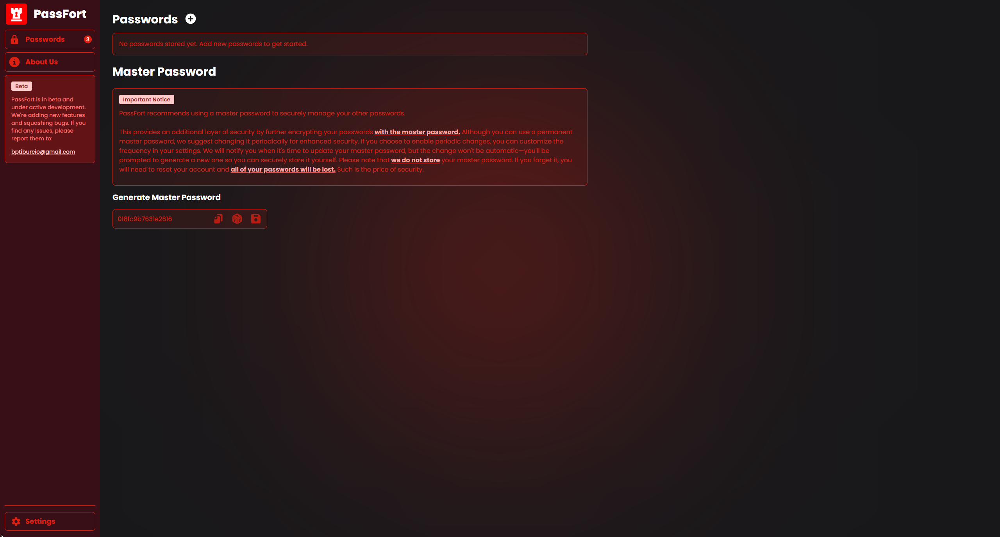

# **PassFort**

A secure and encrypted desktop application for managing passwords.

  
  
  

## **Table of Contents**

1. [Features](#features)
2. [License](#license)
3. [Installation](#installation)
4. [Contributing](#contributing)
5. [Screenshots](#screenshots)

## **Features**

-   Completely free, offline and open-source
-   Out-of-the-box AES-256 encryption for all stored passwords
-   Multi-platform support (Windows, macOS, Linux)
-   User-friendly interface for easy password management
-   Secure password generation tool
-   Auto-lock after inactivity
-   Unlimited password storage

## **License**

This project is licensed under the GNU General Public License v3.0 - see the [LICENSE](./LICENSE) file for details.

## **Intallation**

To be decided

## **Contributing**

Contributions are not allowed at the moment but will be a possibility after the 1.0.0 release.

## **Screenshots**

